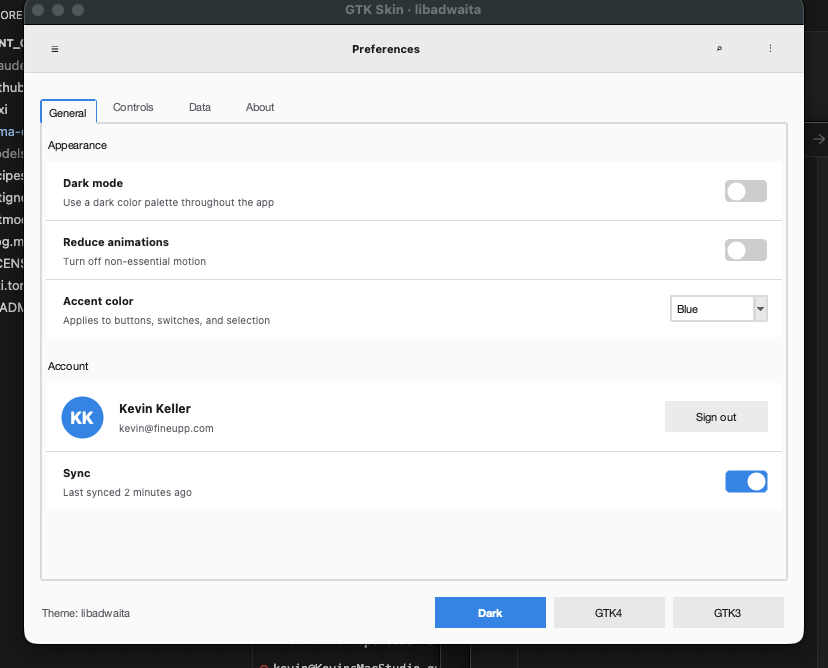
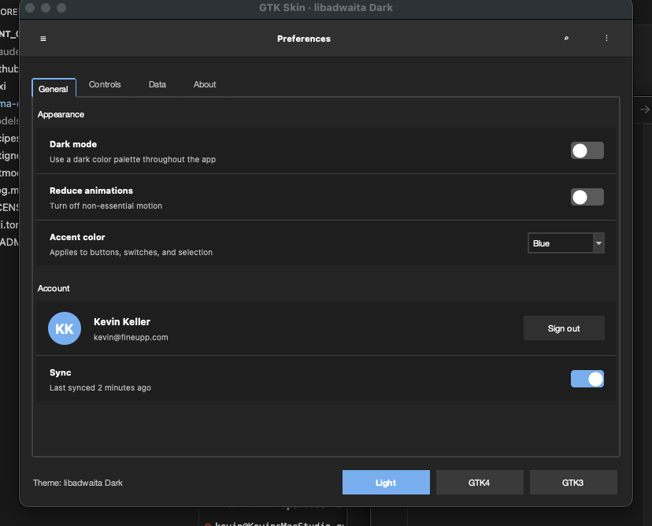
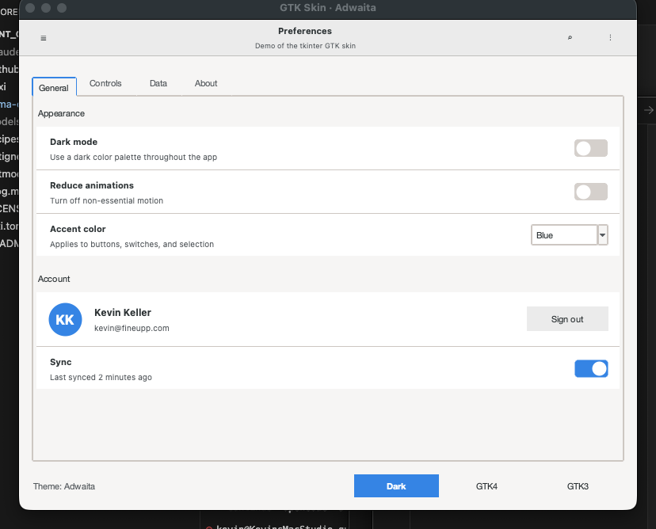
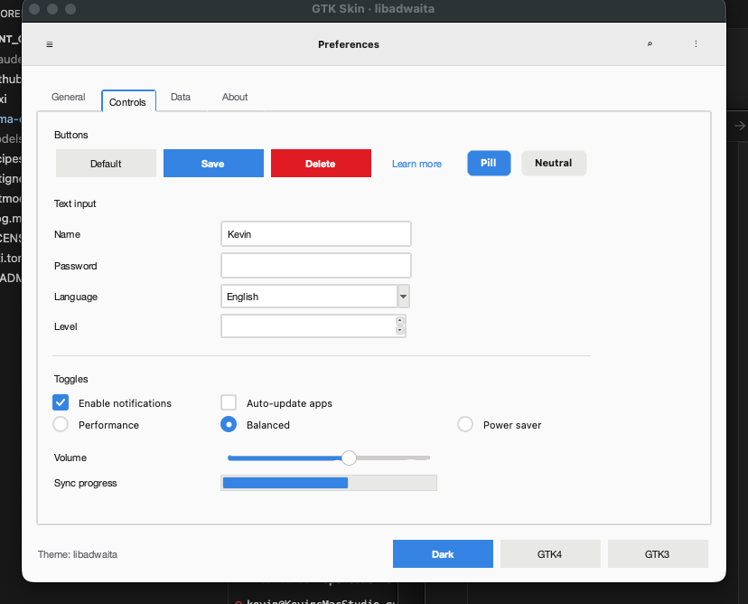

# python_tk_gtk3_gtk4 — GTK3 / GTK4 theme for Python tkinter

A drop-in skin that makes a plain Python `tkinter` app look like it belongs on a modern GNOME desktop. Supports both **GTK3 (Adwaita)** and **GTK4 (libadwaita)** palettes in light and dark modes, and ships a library of canvas-drawn widgets (switches, rounded buttons, slider knobs, GNOME-style list rows, avatars) to fill the gaps that `ttk` alone can't cover.

No PyGObject, no native GTK runtime — it's pure `tkinter` + `ttk` with a rethemed `clam` engine and some carefully drawn `tk.Canvas` widgets on top.

<p align="center">
  
  
</p>

<p align="center">
  
  
</p>

## Features

- Four curated palettes sampled from Adwaita / libadwaita:
  - `GTK3_LIGHT`, `GTK3_DARK` (sharper corners, 3px radius, stacked title+subtitle in header bar)
  - `GTK4_LIGHT`, `GTK4_DARK` (rounder 9px radius, single bold title, softer borders)
- Every built-in `ttk` widget restyled: `TButton`, `TEntry`, `TCombobox`, `TSpinbox`, `TCheckbutton`, `TRadiobutton`, `TNotebook`, `TTreeview`, `TScrollbar`, `TProgressbar`, `TScale`, `TSeparator`, `TLabelframe`.
- Named button styles out of the box: `Suggested.TButton`, `Destructive.TButton`, `Flat.TButton`, `Link.TButton`.
- Named label/frame styles for page hierarchy: `Title.TLabel`, `LargeTitle.TLabel`, `Dim.TLabel`, `Card.TFrame`, `View.TFrame`.
- Custom canvas-drawn widgets where `ttk` isn't good enough:
  - `HeaderBar` — GTK app bar with leading/trailing slots, automatic subtitle only in GTK3 mode
  - `Switch` — GNOME pill toggle with `BooleanVar` binding
  - `PillButton` — rounded accent/flat/destructive buttons
  - `Radio`, `Check` — canvas-drawn GNOME-style indicators (the one place where `ttk`'s `clam` engine looks noticeably macOS-ish)
  - `Scale` — slim accent-filled trough with a circular white knob + hover halo
  - `ListBox` + `ListRow` — the rounded card-with-rows layout GNOME Settings uses everywhere
  - `Avatar`, `Separator`

## Quick start

```bash
git clone https://github.com/KellerKev/python_tk_gtk3_gtk4
cd python_tk_gtk3_gtk4
pixi install
pixi run demo            # GTK4 light
pixi run demo-dark       # GTK4 dark
pixi run demo3           # GTK3
```

Use it in your own app:

```python
import tkinter as tk
from tkinter import ttk
from gtk_skin import apply_skin, HeaderBar, Switch, PillButton

root = tk.Tk()
palette = apply_skin(root, style="gtk4", dark=False)

hb = HeaderBar(root, palette, title="Preferences")
ttk.Button(hb.trailing, text="⋮", style="Flat.TButton").pack(side="right")
hb.pack(fill="x")

ttk.Button(root, text="Save",   style="Suggested.TButton").pack(pady=8)
ttk.Button(root, text="Delete", style="Destructive.TButton").pack(pady=8)

var = tk.BooleanVar(value=True)
Switch(root, palette, variable=var).pack(pady=8)

root.mainloop()
```

## Architecture

Three files do everything:

| File | Responsibility |
|---|---|
| [src/gtk_skin/theme.py](src/gtk_skin/theme.py) | Four `Palette` dataclasses with semantic color roles; `apply_skin()` which configures every `ttk` style on top of the `clam` theme engine and sets `option_add` entries so classic tk widgets (`Entry`, `Listbox`, `Menu`, `Text`) pick up the palette too. |
| [src/gtk_skin/widgets.py](src/gtk_skin/widgets.py) | Canvas-based widgets for everything `ttk` can't render convincingly (rounded shapes, pill toggles, GNOME list cards). |
| [src/gtk_skin/demo.py](src/gtk_skin/demo.py) | A 4-tab preferences-style demo with a live palette switcher in the footer. |

### Why `clam`?

`ttk` ships with several engines (`default`, `alt`, `clam`, `aqua` on macOS, `vista`/`xpnative` on Windows). Most platform engines ignore the `-background`, `-bordercolor`, `-lightcolor`, `-darkcolor` options entirely — they delegate rendering to the OS. `clam` is the only engine on all platforms that honors every themable option, so `apply_skin()` forces it via `style.theme_use("clam")`.

### Why some widgets are canvas-drawn

The `clam` engine has a fixed set of element layouts. A few widgets — specifically `TRadiobutton` and `TScale` — have indicator/thumb elements whose geometry you can't substantially change. They end up looking noticeably macOS-native inside our otherwise-GTK window. To bridge that last gap, [widgets.py](src/gtk_skin/widgets.py) provides `Radio` / `Check` / `Scale` that draw the same thing on a `tk.Canvas` with anti-aliased primitives (`create_oval`, polygon-smoothed rounded rects, two-segment checkmarks).

### Palette structure

Each palette is a frozen dataclass with these role-based fields:

```
window_bg, view_bg, headerbar_bg, headerbar_fg, headerbar_border
fg, muted_fg, dim_fg
border, strong_border
button_bg, button_bg_hover, button_bg_active, button_border
accent, accent_hover, accent_active, accent_fg
selection_bg, selection_fg
success, warning, error
shadow
radius, header_height
```

A custom palette is just `replace(GTK4_LIGHT, accent="#9141ac", accent_hover="#b76fd2", ...)`.

## API reference

### `apply_skin(root, style="gtk4", dark=False) -> Palette`

Applies the skin to a root (or Toplevel). Returns the active `Palette` so custom widgets can pull colors from it. Re-callable at runtime to switch palettes — destroy existing children first if you want a clean redraw.

### Pre-built palettes

- `GTK4_LIGHT`, `GTK4_DARK` — libadwaita
- `GTK3_LIGHT`, `GTK3_DARK` — Adwaita

### Canvas widgets

All take `palette: Palette` as the second positional arg and use keyword args for state bindings:

```python
Switch(parent, palette, variable=BooleanVar, command=callable, width=44, height=24)
PillButton(parent, palette, text, kind="accent"|"flat"|"destructive", command=callable)
Radio(parent, palette, text="", variable=StringVar, value="x", command=callable)
Check(parent, palette, text="", variable=BooleanVar, command=callable)
Scale(parent, palette, from_=0, to=100, value=0, variable=DoubleVar, length=220, command=callable)
HeaderBar(parent, palette, title="", subtitle="")
  # .leading and .trailing frames for packing icon/flat buttons
ListBox(parent, palette)
  # .container is the real parent for rows; .add_row(row) handles separators
ListRow(listbox.container, palette, title="", subtitle="", icon="", trailing=factory_callable)
Avatar(parent, palette, text="AB", size=40, color=None)
Separator(parent, palette, orient="horizontal"|"vertical")
```

### Named styles for ttk

Pass via `style=` to any `ttk.Button`/`Label`/`Frame`:

| Style | Purpose |
|---|---|
| `Suggested.TButton` | Primary action (blue accent fill) |
| `Destructive.TButton` | Red fill for delete/remove |
| `Flat.TButton` | No border until hovered — for header bar icons |
| `Link.TButton` | Blue text, no background |
| `Card.TFrame` | White/view-bg frame with 1px border |
| `View.TFrame` / `View.TLabel` | For content sitting inside a `Card.TFrame` |
| `Header.TLabel` | For text inside a header bar |
| `Title.TLabel` / `LargeTitle.TLabel` | Section/page titles |
| `Dim.TLabel` / `DimView.TLabel` | Muted secondary text |
| `Error.TLabel` / `Success.TLabel` | Colored status text |

## Prerequisites

- Python 3.11+ (ships with tkinter)
- [pixi](https://pixi.sh) for environment management (or your own venv + system tk)

If you're not using pixi: any modern Python with tkinter will work — there are no runtime deps beyond the standard library.

## Gotchas

A few things that tripped me up building this and are worth knowing about:

- **`ttk.Scale` thumb** can't be fully restyled — use `widgets.Scale` instead for a true GNOME knob.
- **`ttk.Radiobutton` indicator** looks macOS-y on macOS — use `widgets.Radio` for the filled-dot GNOME look.
- **The `in_=other_frame` argument to `pack`** is unreliable for canvas widgets that were created with a different master. `ListRow` takes a `trailing` *factory callable* rather than a pre-built widget so the trailing widget's Tk master always matches its geometry parent.
- **`tkinter.Misc` uses `self._w` internally** for the widget's Tcl path. Our canvas widgets store their width/height as `self._cw`/`self._ch` to avoid colliding with that.
- **Font picking**: `apply_skin` probes for Cantarell → Inter → SF Pro Text → Helvetica Neue → Segoe UI → Noto Sans. On Linux with GNOME fonts installed you get the real thing.

## Related projects

The same skin has been ported to two other ecosystems using a shared Tcl file:

- [nim_tk_gtk3_gtk4](https://github.com/KellerKev/nim_tk_gtk3_gtk4) — Nim bindings for Tcl/Tk + the same skin loaded from `resources/gtk_skin.tcl`.
- [freepascal_tk_gtk3_gtk4](https://github.com/KellerKev/freepascal_tk_gtk3_gtk4) — Free Pascal bindings, same shared Tcl skin.

Those projects define the skin in Tcl so it can be sourced by any Tk host. The Python project here uses native `ttk.Style` calls and Python classes instead (predates the Tcl port), but the palettes and visual design are identical.

- [rust_tk_gtk3_gtk4](https://github.com/KellerKev/rust_tk_gtk3_gtk4) — Rust bindings for Tcl/Tk, hand-written FFI + `Result`-based API + closures as Tcl commands, same shared `resources/gtk_skin.tcl`.

## License

MIT.
